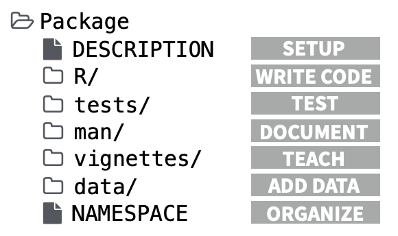
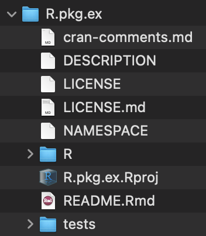
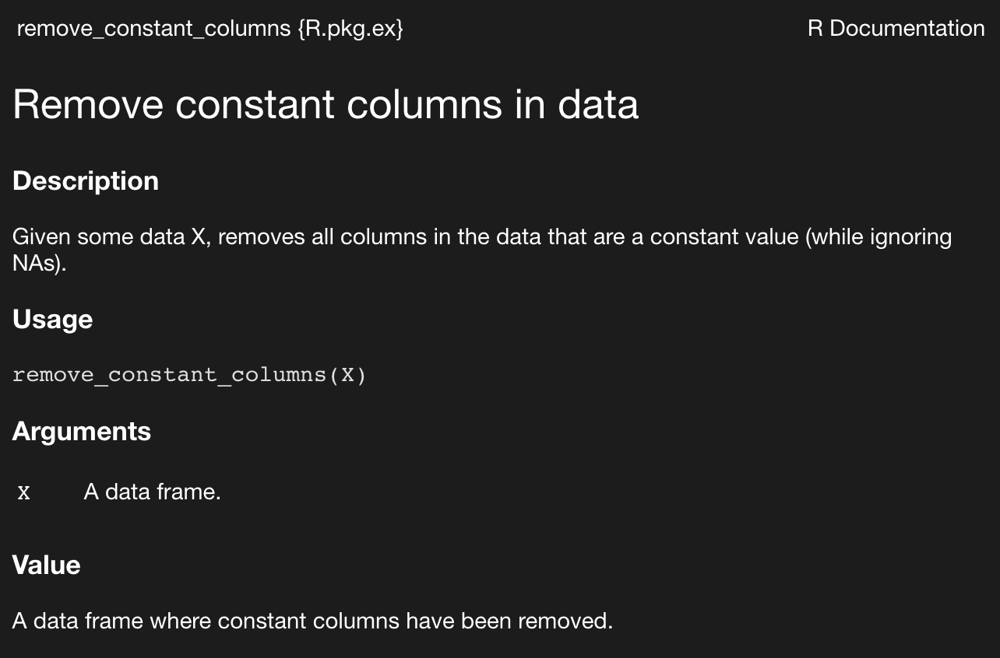
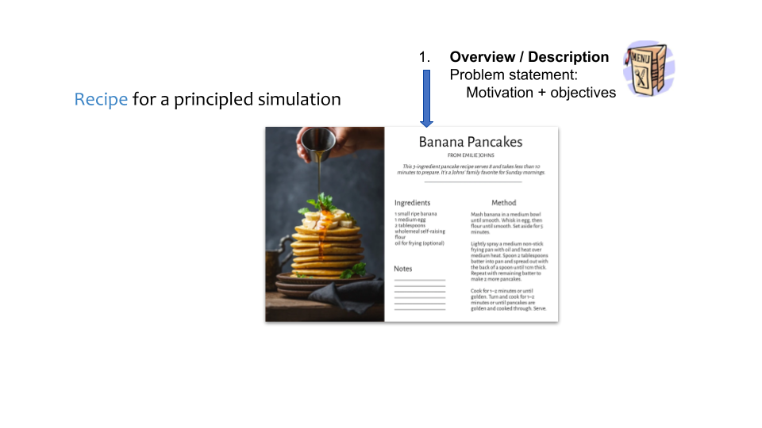
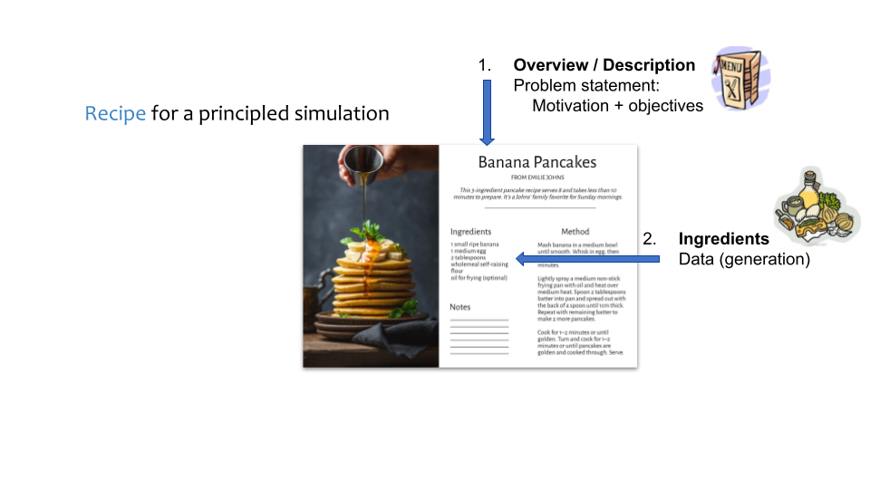
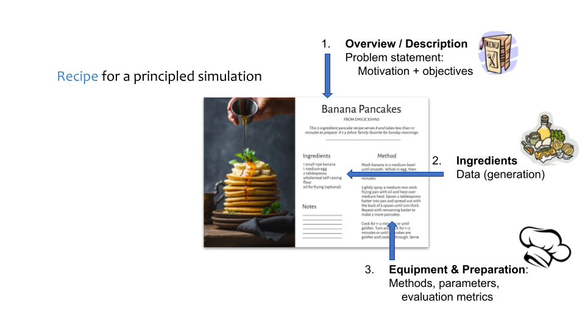
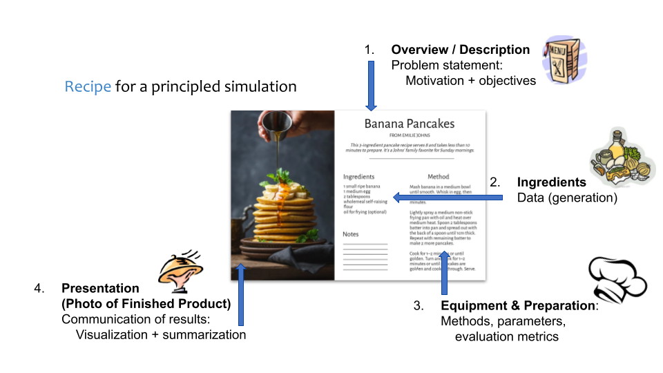

```{r xaringan-themer, include=FALSE, warning=FALSE}
xaringanthemer::style_mono_accent(
  base_color = "#00b0da",
  header_font_google = xaringanthemer::google_font("Josefin Sans"),
  text_font_google   = xaringanthemer::google_font("Montserrat", "300", "300i"),
  code_font_google   = xaringanthemer::google_font("Fira Mono")
)
```

```{r xariganExtra, echo=FALSE}
xaringanExtra::use_fit_screen()
xaringanExtra::use_extra_styles(
  hover_code_line = TRUE,
  mute_unhighlighted_code = TRUE
)
xaringanExtra::use_progress_bar(color = "#0051BA", location = "top")

# xaringanExtra::use_logo("images/simChef.png", link_url="https://github.com/Yu-Group/simChef")
```

```{css, echo=FALSE}
pre {
  max-height: 400px;
  overflow-y: auto;
}

pre[class] {
  max-height: 100px;
}

.remark-code, .remark-inline-code  { font-family: 'Ubuntu Mono'; }
a, a > .remark-inline-code { color: rgb(249, 38, 114); }

.remark-slide-scaler { overflow-y: auto; }

ul { list-style-type: circle; }

.xaringan-extra-logo.simChef {
    width: 110px;
    height: 128px;
    z-index: 0;
    background-image: url(images/simChef.png);
    background-size: contain;
    background-repeat: no-repeat;
    position: absolute;
    top: 1em;
    right: 1em;
}
```

# Roadmap

### 1. R package development
- *Walkthrough*: creating a toy R package
- Useful tools: documentation, unit testing, GitHub actions

### 2. `simChef` for cooking up simulations in R


### 3. `vdocs` (short for veridical docs)


*Resources available at: https://github.com/Yu-Group/r-dev 

---

# Why bother with R packages?

- For sharing re-usable code with others

```r
devtools::install_github("Yu-Group/simChef")

library(simChef)
# You can now use functions from simChef!
```

--

- For organizing your code

<center></center>

--

- Lots of helpful tools that are tied to this package structure (e.g., [`usethis`](https://usethis.r-lib.org/), [`devtools`](https://devtools.r-lib.org/), [`roxygen2`](https://roxygen2.r-lib.org/), [`pkgdown`](https://pkgdown.r-lib.org/))

---

# Let's get started with a toy R package

```r
# create package with tidyverse conventions implemented
usethis::create_tidy_package("R.pkg.ex")  
```

--

This will

- create a new package named `R.pkg.ex`
- apply as many of the tidyverse conventions as possible
- issue a few reminders
- activate the new package.



--

<br><br>

```r
# or alternatively, a more barebones start
usethis::create_package("R.pkg.ex")
```

---

# Writing a reusable R function

All R functions belong in the `R/` directory.

Let's create a file called `R/example_function.R` and add the following to the file:

--

```{r}
remove_constant_columns <- function(X) {
  const_cols <- purrr::map_lgl(X, ~all(duplicated(.x)[-1L]))
  X_cleaned <- X %>%
    dplyr::select(which(!const_cols))
  return(const_cols)
}
```

--

What does this function do?

---

# Documentation with `roxygen2`

```r
#' Remove constant columns in data
#'
#' @description Given some data X, removes all columns in the data that are a
#'   constant value (while ignoring NAs).
#'
#' @param X A data frame.
#'
#' @return A data frame where constant columns have been removed.
#'
#' @examples
#' X <- data.frame(a = c(1, 1, 1), b = c(1, 2, 3))
#' X_cleaned <- remove_constant_columns(X)
#' 
#' @export
remove_constant_columns <- function(X) {
  const_cols <- purrr::map_lgl(X, ~all(duplicated(.x)[-1L]))
  X_cleaned <- X %>%
    dplyr::select(which(!const_cols))
  return(const_cols)
}
```

We can then render the documentation easily via:

```r
devtools::document()  # or equivalently, roxygen2::roxygenise()
```

--

After this, we can see the function documentation via the usual:

```r
? remove_constant_columns
```

<center></center>

---

# Managing dependencies

Note however that `remove_constant_columns` depends on other packages.

```{r, eval = FALSE}
remove_constant_columns <- function(X) {
  const_cols <- `purrr`::map_lgl(X, ~all(duplicated(.x)[-1L]))
  X_cleaned <- X `%>%`
    `dplyr`::select(which(!const_cols))
  return(const_cols)
}
```

--

The `usethis` package makes it easy to manage these dependencies:

```r
usethis::use_package("purrr")
usethis::use_package("dplyr")
usethis::use_pipe()
```

---

# Additional documentation

### Readme

This is the first thing that people will see on GitHub (and package website).

The `README.Rmd` file has already been initialized by `usethis::create_tidy_package()`. We next need to render the README.Rmd into a README.md via:

```r
devtools::build_readme()
```

--

### Creating vignettes

Vignettes are a great way to teach others how to use your code/package.

To begin creating a vignette, `usethis` provides a nice starter template:

```r
usethis::use_vignette("example_vignette")
```

This initializes a vignette found at `vignettes/example_vignette.Rmd`

---

# Creating a website

So far, we have created an R package with a toy R function, some documentation, and a vignette.

An easy way to organize all this documentation and to improve accessibility is through a package website.

```r
pkgdown::build_site()
```

<iframe src="docs/index.html" width=100% height=60%></iframe>

---

# Other useful commands

To check whether or not the package can be built successfully:

```r
devtools::check()
```

[Note that `devtools::check()` rebuilds all the accompanying documentation, runs all unit tests, and goes through CRAN checks.]

<br>
To quickly load in the package under development and its most recent changes:

```r
devtools::load_all()
```

<br>
To automatically style source code according to the tidyverse style guide:

```r
usethis::use_tidy_style()
```

---

# testthat

Testing is an important part of the data science workflow!

`r emo::ji("paperclips")`[`testthat`](https://testthat.r-lib.org/)  makes it simple.

```{r, eval=FALSE}
hitchhiker <- function(x) {
  return(x + 1)
}

testthat::expect_equal(hitchhiker(41), 42)
testthat::expect_equal(hitchhiker(42), 42)

## Error: hitchhiker(42) not equal to 42.
## 1/1 mismatches
## [1] 43 - 42 == 1
```
Other useful `testthat` verbs:
```{r, eval=FALSE}
expect_identical() # test if objects are the same
expect_true(); expect_false()
expect_lt(); expect_gt()
expect_error(); expect_warning()
expect_snapshot() # saves stdout and later compares with this gold standard
```

---

# testthat

`r emo::ji("file_folder")` `testthat` tests should be in a directory called `tests/testthat/` next to your
project's `R/` directory. (`usethis::use_testthat` can set that up for you.)

`r emo::ji("page_facing_up")` `testthat` test files should be named like `test-*.R`, e.g. `test-xyz.R`. Again,
there's a `usethis` function to create this: `usethis::use_test("xyz")`.

`r emo::ji("+1")` create one `test-*.R` file for every `*.R` file in `R/`, e.g.,

Here's an example from `simChef`:
```{r, eval=FALSE}
test_that("fit_experiment works properly with future::multicore", {

  # multicore plan isn't supported on windows
  skip_on_os("windows")

  # fit_experiment_fixture() returns sequential and parallel simulation results
  results <- fit_experiment_fixture(future::multicore)

  expect_identical(results[[1]], results[[2]])
})
```

---

# withr

`r emo::ji("paperclips")`[`withr`](https://withr.r-lib.org/index.html) is another helpful package for
writing testing code and much more.

* Prevents unintended side effects (aka, hard to squash `r emo::ji("mosquito")`!): `with_environment()`
* Cleans up temporary state: `with_tempfile()`
* Helps with reproducibility: `with_seed()`
* Can run arbitrary code when exiting a frame in the call stack: `defer()`, `defer_parent()`

---

# withr in simChef

We use `withr` to temporarily set a `future` plan and reset it when the code
inside of `with_plan` finishes.

```{r, eval=FALSE}
set_plan <- function(plan, ...) {
  # get the original plan so we can reset at the end
  old_plan <- future::plan()
  future::plan(plan, ...)
  return(old_plan)
}

reset_plan <- function(plan) {
  future::plan(plan)
}

with_plan <- withr::with_(set_plan, reset_plan)

fit_experiment_fixture <- function(plan) {
  ... # setup code

  parallel <- withr::with_seed( # set the random seed
    seed,
    with_plan( # set the plan
      plan,
      fit_experiment(experiment, n_reps = 10) # get results in parallel
    )
  )
  return(list(parallel, sequential))
}
```

---

# GitHub Actions

 `r emo::ji("paperclips")`[GitHub Actions](https://docs.github.com/en/actions): automated scripts that run
on GitHub's servers when you make changes to a repo.

They help automate:

* testing
* code "linting" (syntax / style checking)
* (documentation) website deployment
* many other repetitive tasks that run when code changes

---

# r-lib's GitHub actions

Many of the core R packages we've mentioned are maintained in the
`r emo::ji("paperclips")`[`r-lib`](https://github.com/r-lib) GitHub organization, including:
* `devtools`
* `roxygen2`
* `testthat`
* `pkgdown`
* `usethis`

`r-lib` also maintains a very useful repo with many GitHub Actions scripts that
you can use in your workflows: `r emo::ji("paperclips")`[r-lib/actions](https://github.com/r-lib/actions).

Of course there's a `usethis` command:
```{r, eval=FALSE}
# creates an action to run R CMD check
usethis::use_github_actions("check-standard")`
```

You can swap out `"check-standard"` for any of the example actions in [`r-lib/actions/examples/`](https://github.com/r-lib/actions/tree/v2-branch/examples).

---

# Example: Automated grading of STAT 215A lab reports

`r emo::ji("paperclips")`[auto215a](https://github.com/Yu-Group/auto215a/) (private repo)

```yaml
jobs:
  run-grader:

    ...

    strategy:
      fail-fast: false
      matrix:
        student:
          # add all the students here
          - {repo: 'student1-username/stat215a', id: 'anon-id1'}
          - {repo: 'student2-username/stat215a', id: 'anon-id2'}
        lab:
          # add the lab(s) / function(s) to test here
          # each function should be in a separate .R file of the same name
          - {R-dir: 'lab3/R', fun: 'similarity_fn'}

    steps:
        # get this repo and set as the default working directory
      - uses: actions/checkout@v3

        # setup R
      - uses: r-lib/actions/setup-r@v2
        with:
          r-version: 'release'
          use-public-rspm: true

      - name: Install grader dependencies
        run: |
          ## --------------------------------------------------------------------
          install.packages(c("remotes", "lintr"))
          remotes::install_github("Yu-Group/auto215a/auto215aR")
        shell: Rscript {0}

        # checkout student repo
      - uses: actions/checkout@v3
        with:
          repository: ${{ matrix.student.repo }}
          path: ./${{ matrix.student.id }}

      - name: Install student dependencies, test their functions, and lint their code
        run: |
          ## --------------------------------------------------------------------
          # install
          remotes::install_deps()
          # source
          source("${{ matrix.lab.R-dir }}/${{ matrix.lab.fun }}.R")
          # test
          auto215aR::test_${{ matrix.lab.fun }}(${{ matrix.lab.fun }}, submit_id = "${{ matrix.student.id }}")
          # lint
          lintr::lint("${{ matrix.lab.R-dir }}/${{ matrix.lab.fun }}.R")
        shell: Rscript {0}
        working-directory: ./${{ matrix.student.id }}
```

---

# `Yu-Group` Actions

GitHub Action are a key part of the group's project / software development
workflow, used by:

* `simChef`
* `vdocs`
* `vflow`
* `imodels`
* Many more and hopefully yours too!

---

# Additional resources

We created these slides in `Rmarkdown` via the package `r emo::ji("paperclips")`[`xaringan`](https://bookdown.org/yihui/rmarkdown/xaringan.html).

--

These extensions make `xaringan` even more powerful:

* `r emo::ji("paperclips")`[xaringanthemer](https://pkg.garrickadenbuie.com/xaringanthemer)
* `r emo::ji("paperclips")`[xaringanExtra](https://pkg.garrickadenbuie.com/xaringanExtra)

--

Here are some great bookmarks for software dev / productivity in R:

* `r emo::ji("paperclips")`[Advanced R (2nd edition)](https://adv-r.hadley.nz)
* `r emo::ji("paperclips")`[R Packages (2nd edition)](https://r-pkgs.org/)
* `r emo::ji("paperclips")`[bookdown: Authoring Books and Technical Documents with R Markdown](https://bookdown.org/yihui/bookdown/)
* `r emo::ji("paperclips")` [blogdown: Creating Websites with R Markdown](https://bookdown.org/yihui/blogdown/)

---

# simChef

<a class="xaringan-extra-logo simChef" href="https://github.com/Yu-Group/simChef"></a>

`simChef` is an R package to facilitate **transparent** and **reliable** simulation
experiments, with PCS as the guiding framework.

```{css, echo=FALSE}
.faces > img {
    width: 75%;
    padding-top: 10%;
}
```

```{r, eval=FALSE}
devtools::install_github("Yu-Group/simChef")
```

.center.faces[]

---

# simChef

<a class="xaringan-extra-logo simChef" href="https://github.com/Yu-Group/simChef"></a>

`simChef` is an R package to facilitate **transparent** and **reliable** simulation
experiments, with PCS as the guiding framework.

.center.recipe1[]

---

# simChef

<a class="xaringan-extra-logo simChef" href="https://github.com/Yu-Group/simChef"></a>

`simChef` is an R package to facilitate **transparent** and **reliable** simulation
experiments, with PCS as the guiding framework.

.center.recipe2[]

---

# simChef

<a class="xaringan-extra-logo simChef" href="https://github.com/Yu-Group/simChef"></a>

`simChef` is an R package to facilitate **transparent** and **reliable** simulation
experiments, with PCS as the guiding framework.

.center.recipe3[]

---

# simChef

<a class="xaringan-extra-logo simChef" href="https://github.com/Yu-Group/simChef"></a>

`simChef` is an R package to facilitate **transparent** and **reliable** simulation
experiments, with PCS as the guiding framework.

.center.recipe4[]

---

# simChef's goals

<a class="xaringan-extra-logo simChef" href="https://github.com/Yu-Group/simChef"></a>

**Transparent**
* Scientific question **clearly defined** and communicated **honestly**.

--

**Realistic**
* Synthetic data should resemble the **real world** and should use **real data**
as much as possible.

--

**Intuitive**
* Simulation code should be **readable** and **understandable**.

--

**Efficient**
* Simulations should take advantage of **distributed computation**.

--

**Reproducible**
* Results should be **consistent** across runs, users, and computing
environments and they should be **easy to share**.

---

# simChef basic usage

<a class="xaringan-extra-logo simChef" href="https://github.com/Yu-Group/simChef"></a>

```{r, eval=FALSE}
experiment <- create_experiment(name = "my-exper")
```

---

# simChef basic usage

<a class="xaringan-extra-logo simChef" href="https://github.com/Yu-Group/simChef"></a>

```{r, eval=FALSE}
experiment <- create_experiment(name = "my-exper") %>%
  add_dgp(dgp) # DGP = data-generating process
```

---

# simChef basic usage

<a class="xaringan-extra-logo simChef" href="https://github.com/Yu-Group/simChef"></a>

```{r, eval=FALSE}
experiment <- create_experiment(name = "my-exper") %>%
  add_dgp(dgp) %>% # DGP = data-generating process
  add_method(method) # method under study
```

---

# simChef basic usage

<a class="xaringan-extra-logo simChef" href="https://github.com/Yu-Group/simChef"></a>

```{r, eval=FALSE}
experiment <- create_experiment(name = "my-exper") %>%
  add_dgp(dgp) %>% # DGP = data-generating process
  add_method(method) %>% # method under study
  add_evaluator(eval) # evaluates simulation results
```

---

# simChef basic usage

<a class="xaringan-extra-logo simChef" href="https://github.com/Yu-Group/simChef"></a>

```{r, eval=FALSE}
experiment <- create_experiment(name = "my-exper") %>%
  add_dgp(dgp) %>% # DGP = data-generating process
  add_method(method) %>% # method under study
  add_evaluator(eval) %>% # evaluates simulation results
  add_visualizer(viz) # creates plots / tables / other visual summaries for Rmd
```

---

# simChef basic usage

<a class="xaringan-extra-logo simChef" href="https://github.com/Yu-Group/simChef"></a>

```{r, eval=FALSE}
experiment <- create_experiment(name = "my-exper") %>%
  add_dgp(dgp) %>% # DGP = data-generating process
  add_method(method) %>% # method under study
  add_evaluator(eval) %>% # evaluates simulation results
  add_visualizer(viz) # creates plots / tables / other visual summaries for Rmd

fit_experiment(experiment,
               n_reps = 100, # number of replicates for each combo of (dgp, method)
               save = TRUE, # save results to disk
               checkpoint_n_reps = 20) # save intermediate results as we go
```

---

# simChef basic usage

<a class="xaringan-extra-logo simChef" href="https://github.com/Yu-Group/simChef"></a>

```{r, eval=FALSE}
experiment <- create_experiment(name = "my-exper") %>%
  add_dgp(dgp) %>% # DGP = data-generating process
  add_method(method) %>% # method under study
  add_evaluator(eval) %>% # evaluates simulation results
  add_visualizer(viz) # creates plots / tables / other visual summaries for Rmd

fit_experiment(experiment,
               n_reps = 100, # number of replicates for each combo of (dgp, method)
               save = TRUE, # save results to disk
               checkpoint_n_reps = 20) # save intermediate results as we go

# A tibble: 100 × 9
   .rep  .dgp_name .method_name param1 param2 vec          .n  .rho .noise_level
   <chr> <chr>     <chr>         <dbl>  <dbl> <list>    <dbl> <dbl>        <dbl>
 1 1     dgp1      method1           1      3 <dbl [3]>    10   0.5            1
 2 1     dgp1      method1           2      3 <dbl [3]>    10   0.5            1
 3 1     dgp1      method1           1      4 <dbl [3]>    10   0.5            1
 4 1     dgp1      method1           2      4 <dbl [3]>    10   0.5            1
 5 1     dgp1      method1           1      3 <int [6]>    10   0.5            1
# … with 95 more rows
```

---

# DGPs

User's can write their own custom DGP functions.

```{r, eval=FALSE}
my_linear_gaussian_dgp_fun <- function(n, p) {

  ## generate covariate matrix
  X <- matrix(rnorm(n = n*p), nrow = n)

  ## sample linear model coefficients
  betas <- sample(
    c(0, 0.5, 1), size = p,
    replace = TRUE, prob = c(0.5, 0.3, 0.2)
  )

  ## create a linear response y with additive gaussian noise
  y <- cbind(1, X) %*% c(1, betas) + rnorm(n)

  return(list(X = X, y = y, betas = betas))
}
```

---

# DGPs

This function is then passed to `simChef` to create a `DGP` (with optional
default values for `n` and `p`).

```{r, eval=FALSE}
my_linear_gaussian_dgp_fun <- function(n, p) {
  ...
}

dgp <- create_dgp(
  my_linear_gaussian_dgp_fun,
  n = 100, p = 3
)

simChef::list_to_tibble_row(
  dgp$generate()
)

## # A tibble: 1 × 3
   X                y               betas
   <list>           <list>          <list>
 1 <dbl [100 × 3]>  <dbl [100 × 1]> <dbl [3]>
```

---

# `dgpoix` `r emo::ji("carrot")` A reusable library of DGPs

DGPs are the key **ingredients** of every simulation.

We can quickly recreate the last example using `dgpoix`.

(Pronounced "dee-gee-pwaa", rhymes with "mirepoix").

```{r, eval=FALSE}
linear_gaussian_dgp <- create_dgp(
  dgpoix::linear_gaussian_dgp,
  # params for linear_gaussian_dgp:
  n = 100, p_obs = 3, intercept = 1, err = rnorm
  # dgpoix::coef_sampler function and its params:
  betas = dgpoix::coef_sampler,
  coefs = c(0, 0.5, 1), probs = c(0.5, 0.3, 0.2)
)
```

`dgpoix` is currently in very early development, so expect the API to change.

---

# Varying across DGP / method parameters

After adding DGPs and methods, we can set out experiment to vary across multiple
parameter values.

```{r, eval=FALSE}

elnet <- create_method(
  function(X, y, alpha=1) {
    fit <- glmnet::glmnet(
      x = X, y = y, family = "gaussian", alpha = alpha
    ) %>% broom::tidy()
    return(fit)
  }
)

experiment <- create_experiment() %>%
  add_dgp(linear_gaussian_dgp) %>%
  add_method(elnet) %>%
  add_vary_across(
    linear_gaussian_dgp,
    p_obs = c(10, 100), # observed covariates
    p_unobs = c(2, 20), # unobserved covariates
    # varying over a vector-valued parameter 'probs':
    probs = list(c(0.5, 0.3, 0.2), c(0.8, 0.1, 0.1))
  )
```

---

# Run the experiment

We can run the experiment in parallel by setting a
`r emo::ji("paperclips")`[`future`](https://future.futureverse.org/) plan
before calling `fit_experiment`.

```{r, eval=FALSE}
future::plan(future::multicore)

results <- fit_experiment(experiment, n_reps = 100)
## Fitting experiment...
```

---

# Automated R Markdown Documentation

**Rapid** and **convenient** reporting of *results*

**Transparent** and **organized** communication of the *simulation design + code*

All in one line of code:

```r
create_rmd(experiment)
```

---
class: no-padding

<iframe src="rmd/linear_regression_output.html" width=100% height=100%></iframe>

---

# vdocs (veridical docs)

`vdocs` is an R package to easily create beautiful documentation of data analyses, guided by the PCS framework.

```{css, echo=FALSE}
.faces2 > img {
    width: 50%;
    <!-- padding-top: 10%; -->
}
```

```{r, eval=FALSE}
devtools::install_github("Yu-Group/vdocs")
```

.center.faces2[]

Motivated by our collaboration with MD Anderson (Ehsan Irajizad, Johannes Fahrmann, Sam Hanash) 

Need for an **interactive guide** to walk practitioners through the data science life cycle with a PCS lens

**Our aim**: create an interactive *PCS lab notebook*, analogous to a scientific lab notebook

---

# PCS Lab Notebook


---

# PCS Lab Notebook


---

class: no-padding

<iframe src="rmd/TCGA-BRCA-Example.html" width=100% height=100%></iframe>

---

# Try it for yourself!

<div style="width: 50%; float: left; text-align: center">
<h3 style="text-align: center; margin-top: 30px; margin-bottom: 10px;">simChef</h3>
for realistic, reliable, reproducible,<br>and responsible simulations
<br>
<a href="https://github.com/Yu-Group/simChef">https://github.com/Yu-Group/simChef</a>
</div>

<div style="margin-left:50%; text-align: center">

<h3 style="text-align: center; padding-top: 30px; margin-bottom: 10px;">vdocs</h3>
for beautiful and easy<br>documentation of PCS analyses
<br>
<a href="https://github.com/Yu-Group/vdocs">https://github.com/Yu-Group/vdocs</a>
</div>

<br>

*For development of your own Rmd-generated html documents, check out: https://github.com/Yu-Group/vthemes 

<br>

<h2 style="text-align: center;">Let us know what you think!</h2>

---
